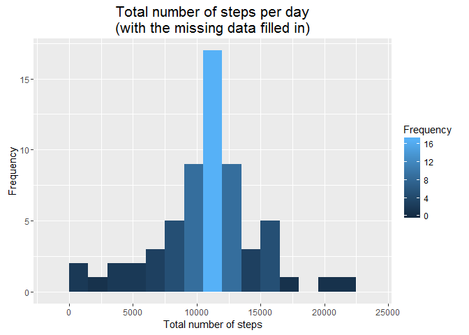

# Reproducible Research: Peer Assessment 1


## Loading and preprocessing the data

Load and unzip the data


```r
setwd("D:/Coursera/RepRes/RepData_PeerAssessment1")
unzip("activity.zip")
data <- read.csv("activity.csv")
```

Remove file activity.csv after reading the data


```r
file.remove("activity.csv")
```

```
## [1] TRUE
```

```r
library(dplyr)
```

```
## 
## Attaching package: 'dplyr'
## 
## The following objects are masked from 'package:stats':
## 
##     filter, lag
## 
## The following objects are masked from 'package:base':
## 
##     intersect, setdiff, setequal, union
```

```r
library(ggplot2)
library(scales)

glimpse(data)
```

```
## Observations: 17,568
## Variables: 3
## $ steps    (int) NA, NA, NA, NA, NA, NA, NA, NA, NA, NA, NA, NA, NA, N...
## $ date     (fctr) 2012-10-01, 2012-10-01, 2012-10-01, 2012-10-01, 2012...
## $ interval (int) 0, 5, 10, 15, 20, 25, 30, 35, 40, 45, 50, 55, 100, 10...
```

Transform the data into a format suitable for my analysis


```r
data$date <- as.Date(data$date)
data$interval <- sprintf("%04d", data$interval)
data$interval <- format(strptime(data$interval, format = "%H%M"), 
                        format = "%H:%M")
```


## What is mean total number of steps taken per day?

1. Calculate the total number of steps taken per day


```r
dataSteps <- data %>%
    group_by(date) %>%
    summarise(totalSteps = sum(steps))
```

2. Make a histogram of the total number of steps taken each day


```r
ggplot(dataSteps, aes(x = totalSteps)) +
    geom_histogram(binwidth = 1500, aes(fill = ..count..)) +
    scale_fill_continuous(name = "Frequency") +
    ggtitle("Total number of steps per day") +
    xlab("Total number of steps") +
    ylab("Frequency") + 
    theme(plot.title = element_text(size = 16))
```

```
## Warning: Removed 8 rows containing non-finite values (stat_bin).
```

 

3. Calculate and report the mean and median of the total number of steps 
taken per day


```r
dataSteps_m <- dataSteps %>% 
    summarise(meanSteps = mean(totalSteps, na.rm = TRUE), 
              medianSteps = median(totalSteps, na.rm = TRUE))
print(dataSteps_m)
```

```
## Source: local data frame [1 x 2]
## 
##   meanSteps medianSteps
##       (dbl)       (int)
## 1  10766.19       10765
```


## What is the average daily activity pattern?

1. Make a time series plot (i.e. type = "l") of the 5-minute interval (x-axis)
and the average number of steps taken, averaged across all days (y-axis)


```r
dataDaily <- data %>%
    group_by(interval) %>%
    summarise(avgTotalNSteps = mean(steps, na.rm = TRUE))
dataDaily$interval <- as.POSIXct(dataDaily$interval, format = "%H:%M", 
                                 tz = "CST6CDT")

ggplot(dataDaily, aes(x = interval, y = avgTotalNSteps)) +
    geom_line(lwd = .9, color = "blue") +
    scale_x_datetime(labels = date_format("%H:%M")) + 
    xlab("Time") +
    ylab("Average number of steps") +
    ggtitle("Average number of steps during the day") + 
    theme(plot.title = element_text(size = 16))
```

 

2. Which 5-minute interval, on average across all the days in the dataset, 
contains the maximum number of steps?


```r
dataDaily %>% filter(avgTotalNSteps == max(avgTotalNSteps))
```

```
## Source: local data frame [1 x 2]
## 
##              interval avgTotalNSteps
##                (time)          (dbl)
## 1 2015-12-19 08:35:00       206.1698
```


## Imputing missing values

1. Calculate and report the total number of missing values in the dataset 
(i.e. the total number of rows with NAs)


```r
sum(is.na(data))
```

```
## [1] 2304
```

```r
sum(is.na(data$steps))
```

```
## [1] 2304
```

2. Devise a strategy for filling in all of the missing values in the dataset. 
I've used the mean for that 5-minute interval


```r
repData <- data %>%
    group_by(interval) %>%
    summarise(avgTotalNSteps = round(mean(steps, na.rm = TRUE))) 
```

3. Create a new dataset that is equal to the original dataset but with 
the missing data filled in.


```r
dataImp <- data
dataImp$steps_imp <- dataImp$steps
imp <- is.na(dataImp$steps_imp)
ints <- dataImp$interval[imp]
dataImp$steps_imp[imp] <- repData$avgTotalNSteps[repData$interval %in% ints]

dataImputed <- dataImp %>% select("steps" = steps_imp, date, interval)
```

4. Make a histogram of the total number of steps taken each day. 


```r
dataStepsImp <- dataImputed %>%
    group_by(date) %>%
    summarise(totalStepsImp = sum(steps))

ggplot(dataStepsImp, aes(x = totalStepsImp)) +
    geom_histogram(binwidth = 1500, aes(fill = ..count..)) +
    scale_fill_continuous(name = "Frequency") +
    ggtitle("Total number of steps per day\n(with the missing data filled in)")+
    xlab("Total number of steps") +
    ylab("Frequency") + 
    theme(plot.title = element_text(size = 16))
```

 

Calculate and report the mean and median total number of steps taken per day. 


```r
dataStepsImp_m <- dataStepsImp %>% 
    summarise(meanStepsImp = mean(totalStepsImp, na.rm = TRUE), 
              medianStepsImp = median(totalStepsImp, na.rm = TRUE))
print(dataStepsImp_m)
```

```
## Source: local data frame [1 x 2]
## 
##   meanStepsImp medianStepsImp
##          (dbl)          (dbl)
## 1     10765.64          10762
```

Compare with the values from the first part of the assignment


```r
print(dataSteps_m)
```

```
## Source: local data frame [1 x 2]
## 
##   meanSteps medianSteps
##       (dbl)       (int)
## 1  10766.19       10765
```

Values with imputation are very close from the estimates from the first part 
of the assignment.


## Are there differences in activity patterns between weekdays and weekends?

1. Create a new factor variable in the dataset with two levels - "weekday" 
and "weekend" indicating whether a given date is a weekday or weekend day.


```r
dataImputed$weekday <- weekdays(dataImputed$date)
dataImputed$weekday <- ifelse(dataImputed$weekday %in% c("Saturday","Sunday"), 
                           "Weekend", "Weekday")
dataImputed$weekday <- as.factor(dataImputed$weekday)
```

2. Make a panel plot containing a time series plot (i.e. type = "l") of the 
5-minute interval (x-axis) and the average number of steps taken, 
averaged across all weekday days or weekend days (y-axis).


```r
dataCompare <- dataImputed %>% 
    group_by(interval, weekday) %>%
    summarise(avgSteps = mean(steps))
dataCompare$interval <- as.POSIXct(dataCompare$interval, format = "%H:%M",
                                   tz = "CST6CDT")

ggplot(dataCompare, aes(x = interval, y = avgSteps)) + 
    facet_wrap(~ weekday, ncol = 1) +
    geom_line(lwd = .9, color = "blue") +
    scale_x_datetime(labels = date_format("%H:%M")) + 
    xlab("Time") +
    ylab("Average number of steps") +
    ggtitle("Average number of steps during the day\n (weekdays vs weekends)") + 
    theme(plot.title = element_text(size = 16),
          strip.text = element_text(size = 12),
          strip.background = element_rect(colour="darkgrey", fill = "#FFFFCC"))
```

 

There are some differences in activity patterns between weekdays and weekends. 
The distribution of step during the day is bit more uniform in the weekends.
